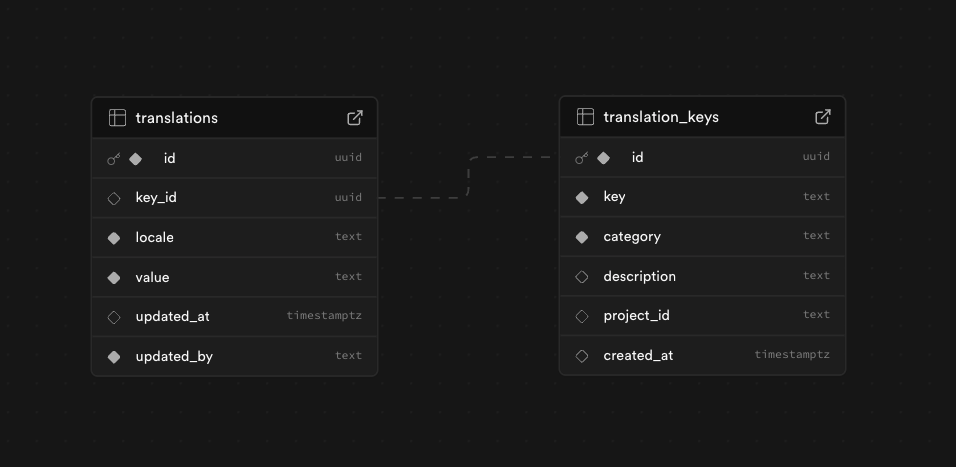

# Localization Management Backend

This is a FastAPI application to manage localizations for different projects.

## Setup

1.  Create a virtual environment (optional but recommended):

    ```bash
    python -m venv venv
    source venv/bin/activate  # On Windows use `venv\Scripts\activate`
    ```

2.  Install dependencies:
    ```bash
    pip install -r requirements.txt
    ```

## Running the server

```bash
PYTHONPATH=src uvicorn src.localization_management_api.main:app --reload
```

The API will be available at `http://127.0.0.1:8000`.

## Example Usage

### `GET /localizations/:projectId/:locale`

**Purpose:** Retrieve all the localizations for the _project=projectId_ and _locale=locale_

**Responses:**

- `200 OK`

```json
{
    "locale": "en",
    "project_id": "1"
    "localizations": [
        {
            "id": "abcd1234-abc1-d234-bac6-09fdc258f349",
            "key": "button.save",
            "category": "buttons",
            "value": "Save",
            "updatedAt": "2025-06-06T22:17:04.150507+00:00"
        },
        ...
    ]
}
```

- `500 Internal Server Error` – Server failure

### `GET /localizations/:locale`

**Purpose:** Retrieve all the localizations for the _every_ project and _locale=locale_

**Responses:**

- `200 OK`

```json
{
    "locale": "en",
    "localizations": [
        {
            "id": "abcd1234-abc1-d234-bac6-09fdc258f349",
            "key": "button.save",
            "category": "buttons",
            "value": "Save",
            "updatedAt": "2025-06-06T22:17:04.150507+00:00"
        },
        ...
    ]
}
```

- `500 Internal Server Error` – Server failure

### `GET /analytics/completion/:projectId`

**Purpose:** generates simple analytics (translation completion percentages for each language/locale)

**Responses:**

- `200 OK`

```json
{
  "project_id": 1,
  "completion": {
    "en": 100,
    "es": 95,
    "pt": 80
  }
}
```

- `500 Internal Server Error` – Server failure

## Database

A simple supabase database with 2 tables was created for the required scope of this challenge

**translations**

- id (Primary key)
- key_id (Foreign key)
- locale (Plain text. Could be related to a Locale table in future improvements)
- value (Plain text representing the translation itself)
- updated_at (Timestamp representing the last update)
- updated_by (Plain text. Could be related to a Users table in future improvements)

**translation_keys**

- id (Primary key)
- key (Plain text representing translation code/key)
- category (Plain text representing the category. It's necessary for filtering)
- description (Plain text representing the translation description)
- project_id (Plain text. Could be related to a Projects table in future improvements)
- created_at (Timestamp representing the date when it was created)


